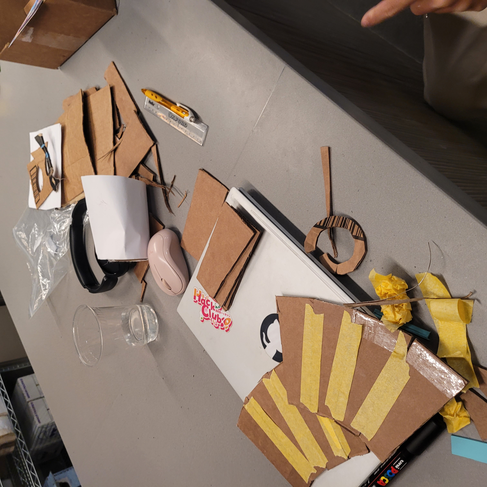
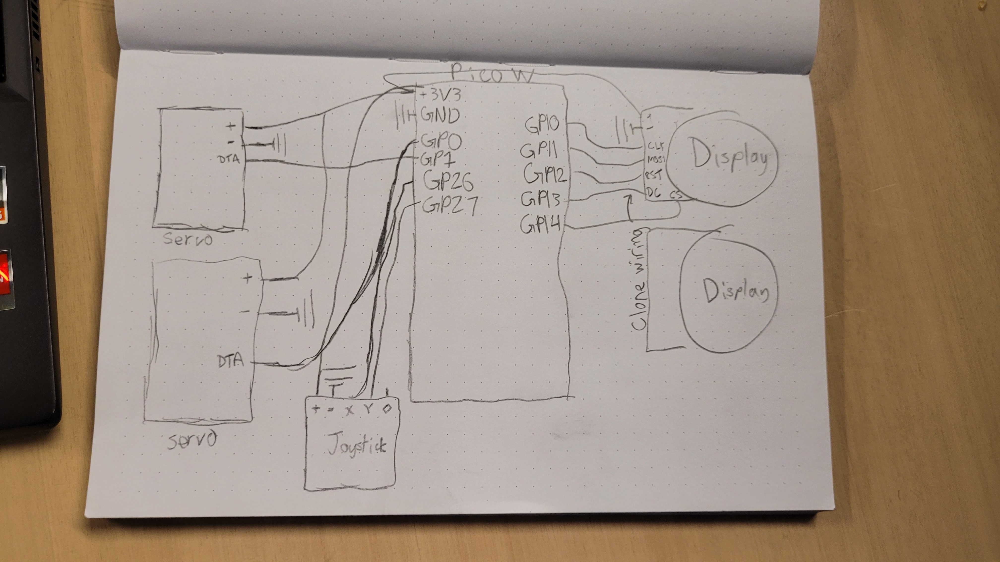
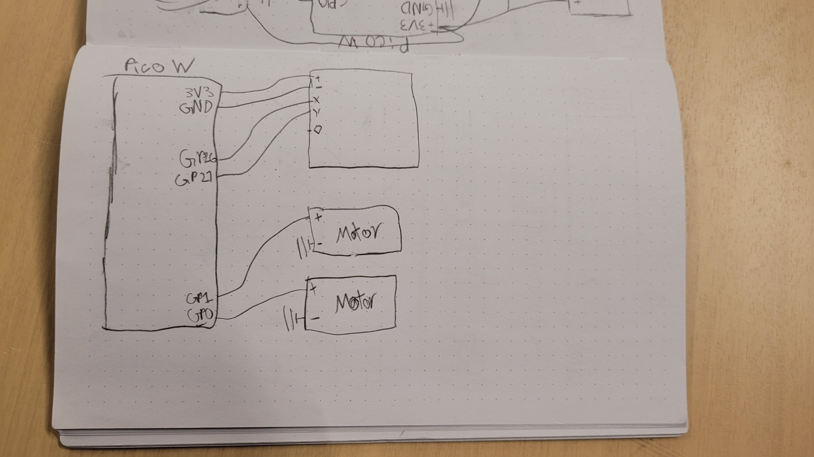

# orphbot

Orphbot is a janky two-part robot inspired by the Onboard Orpheus Hack Club sticker:

It was somehow made in ~50 hours at Hack Club Undercity, while juggling preparing to run an ARG called Undernet (open source soon!), exploring San Francisco, and attending the many, many workshops. 

The first part is Orpheus' body. She has a head with two degrees of freedom controlled by a joystick, and really cool eyes made of round TFT displays.

Orpheus' PCB skateboard was made on the last day (it's 3:44 AM as I, hex4, write this) and is arguably the jankiest but also funnest part. It's powered by a Pi Pico connected to some DC motors.

Orphbot was made by Neven (Canada, @hex4), Jason (Hong Kong), and Jenin (Canada).

[watch the "video"](https://youtube.com/shorts/jfWwtk3ynPc)

## Wiring

### Body

- Connect the black and red pins of the servos to 5V or VBUS on the Picos
- Connect the servo data lines to GP0 and GP1
- Wire up the joystick's 5V and GND pins to 3V3 and GND
- Wire up X and Y to GP27 and GP26
- Power the first display with 5 or 3v and GND.
- Connect the display's other pins: CLK to GP10, MOSI to GP11, RST to GP12, DC to GP13, and CS to GP14.
- Connect the other display's pins to the exact same ones on the Pico. I don't know why this works, but it does!

### Skateboard

- Wrire up the motors to GP0/1 and ground. This is scary but it kinda works with small motors!

## BOM

| PART                                 | QUANTITY       |
|--------------------------------------|----------------|
| Pi Pico W                            | 2              |
| Servos                               | 2              |
| Joystick                             | 2              |
| 3D printed head                      | 1              |
| 3D printed body                      | 1              |
| Round TFT display                    | 2              |
| Jumper wires                         | Lots           |
| Small DC motors                      | 2              |
| Wheels (3D printed)                  | 3 (2 can work) |
| Cardboard skateboard with PCB design | 1              |
| Power bank                           | 2              |
| Breadboard                           | 2              |

Made with sleep deprivation by Neven, Jason, and Jenin

